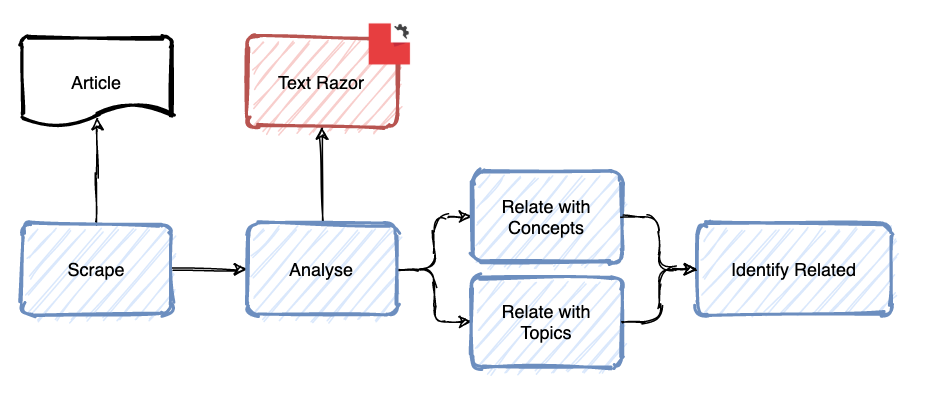
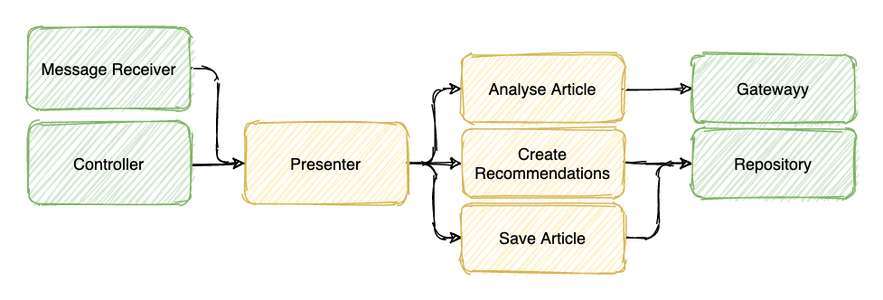

# descartes 🕵️‍♂️
  

Collaborative content discoverability network for independent writers.


Hosting a personal blog instead of joining a platform like Medium removes the network effects. Descartes aims to create an underneath network of content delivery and recommendation based on the content itself. Descartes aims to connect personal blogs and help readers find quality related content. Descartes is privacy first. No data about the readers that read the content is needed.

## Run tests

As the first thing to be done when somebody arrives to a project, tests can be executed with only one command.

```sh
make test
```

You can run only one test or one test file by passing the `ONLY` parameter:

```sh
make test ONLY=CreateArticleTest
```

## Run the application locally

To run this application locally you only have to run one command. But you need a [TextRazor](https://www.textrazor.com/docs/java) api key and pass it to that command:

```sh
make up ANALYSER_APIKEY=REPLACE_ME
```

Check the application is up and running at [localhost:8080/health](http://localhost:8080/health).

Then you can shut everything down with:

```sh
make down
```

## Business Logic

Currently, the flow to identify if an article is related to another article is based on the content itself. An article is scraped, analysed and categorised so it can be considered as a recommendation for another articles and vice versa.



Descartes is using [Skrape{it}](https://github.com/skrapeit/skrape.it) to scrape the articles and [TextRazor](https://www.textrazor.com/) to analyse the text.

## Architecture

This application follows an architecture similar to [Model View Presenter](https://en.wikipedia.org/wiki/Model-view-presenter). However, it is a more simplified version.



A few things to note about it:

* The _Controller_,  _Message Receiver_, _Gateway_ and _Repository_ are the outer world. Everything in between is what happens inside the application's domain.
* Decouple business logic from the _Controller_ and _Message Receiver_ and from any framework related dependency by delegating to a _Presenters_ as fast as possible.
* _Actions_ are composable small pieces of business logic. A _Presenter_ will combine them to achieve more complex business cases.
* An _Action_ is a verb. It is a class, and not a function, only because Dependency Injection is easier that way. Actually we advise you to use the `invoke operator`.

## System Design

Descartes is a [Spring](https://spring.io/) application written in [Kotlin](https://kotlinlang.org/) and it usually runs in a [Docker](https://www.docker.com/) container. It uses [RabbitMQ](https://www.rabbitmq.com/) as message broker and [PostgreSQL](https://www.postgresql.org/) as a database.


Right now the application is [deployed through Heroku](https://descartes-asdf.herokuapp.com/). And some configurations are tied to the details of [Heroku](https://www.heroku.com/home) or those of some addons like [PostgreSQL](https://elements.heroku.com/addons/heroku-postgresql).

## Contributing

Anyone is welcome to participate but first please take a look at the [contributing guidelines](CONTRIBUTING.md).
